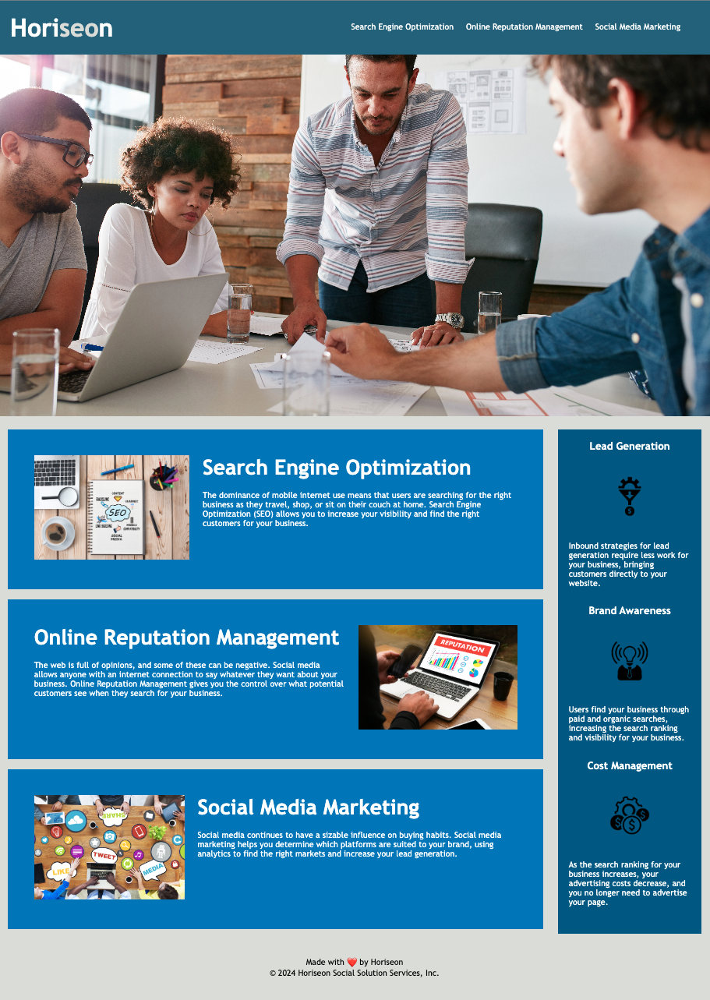

# Marketing Accessibility Optimization website
This repo will be used for submitting the challenge for the week 1 "01 HTML, CSS, and Git"

## Description

- The motivation for doing this project is because I want to practice and test my knowledge about what I learnt during the first week of the bootcamp.
- This project is focused on code refactoring to clean up the codebase, make it better, and more aligned with accessibility and SEO standards, also improving code readability, reducing complexity, and improving performance.

## Table of Contents

- [Learnings](#learnings)
- [Website](#website)
- [License](#license)

## Learnings

- While working on this project I had the chance to work on things I learnt in my firts week, such as:
    - Implementing git workflow from creating a repository, to cloning to my local machine, to adding code to it, to commiting it, to pushing it, and so on.
    - Deploying my website to GitHub Pages.
    - Enhancing HTML code quality while applying semantic HTML elements best practices, creating a logical structure for it, ading "alt" attributes to enhance accessibility, organising heading attributes, adding title and better descriptions where it's needed.
    - Enhancing CSS code while reducing the number of classes (using more universal and elements instead), reducing dramatically the number of code lines, cleaning up what wasn't necessary, and adding comments to make the code more understandable.

- New learnings:
    - HTML
        - how to organise the code with `<main>` and `<aside>`tags.
    - CSS
        - How to use the pseudo-class `:hover`,
        - How to use styles such as `scroll-margin-top`, `float`, `z-index`
        - How to add styles using descendant selector such as `.full-width-image-container img { width:100%; height: 100%; object-fit: cover;}`

## Website

This is the website screenshot

## License

MIT License
